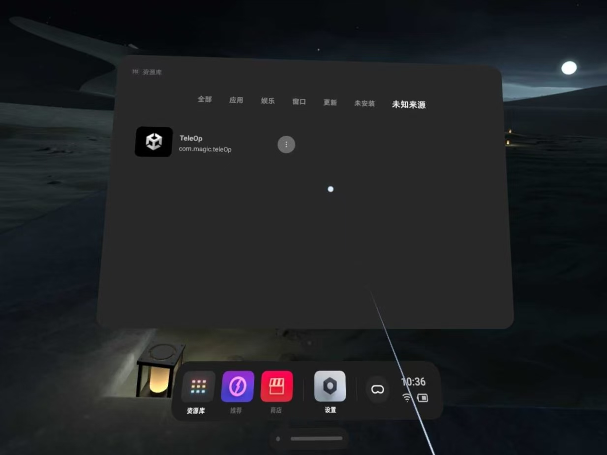

# Magicbot-Gen1 PICO4 Ultra Teleoperation

## 概述
该仓库实现了使用PICO4 Ultra对人形机器人Magicbot-Gen1的遥操作控制。

[English](./README_EN.MD)

## 开始

### 连接Magicbot-Gen1
1.通过MagicLab APP连接机器人，点击选择模式按钮

2.选择遥控特技

3.长按站立，将机器人放下至平坦路面

4.依次点击下方的步态按钮和右方的姿态展示按钮，切换至姿态展示模式

### 连接PICO4 Ultra
1.穿戴VR头显,在胸口及左右手腕背部各佩戴一个体感传感器

2.将PICO与机器人连接至同一Wi-Fi

3.启动TeleOp程序

4.选择跟踪模式为Motion

5.记录PICO4 Ultra的IP地址

6.点击右上角的设置按钮，选择PICO控制

7.输入PICO4 Ultra的IP地址，点击开始按钮

8.依次按动左手手柄的x和y按钮，开始进行遥操，遥操结束后点击结束按钮即可