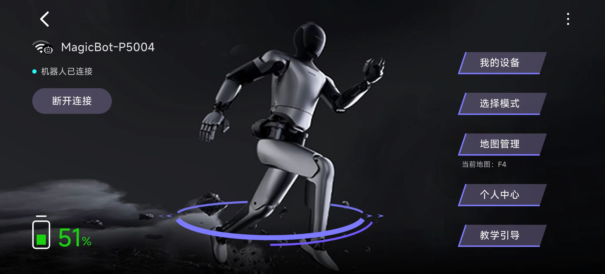
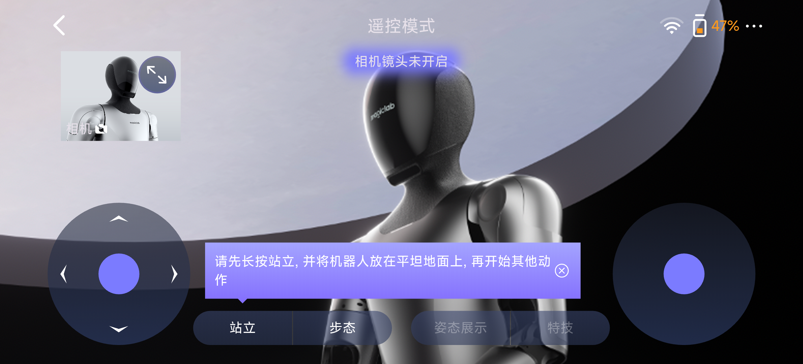
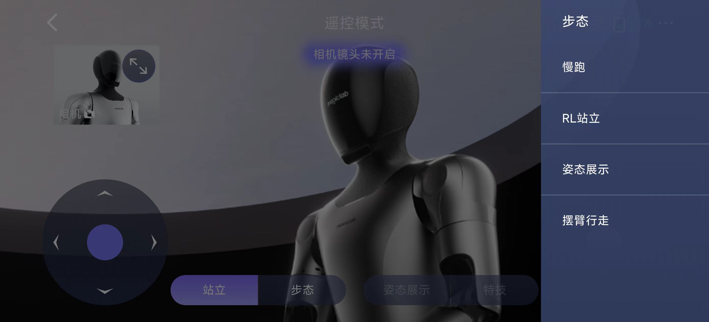
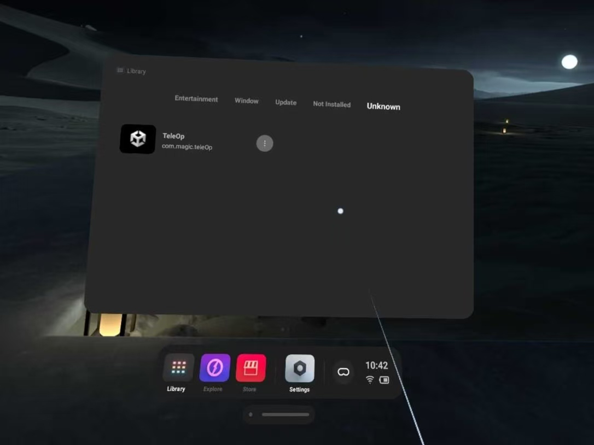
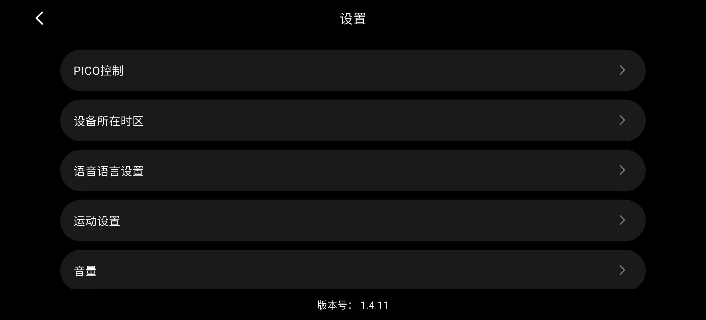
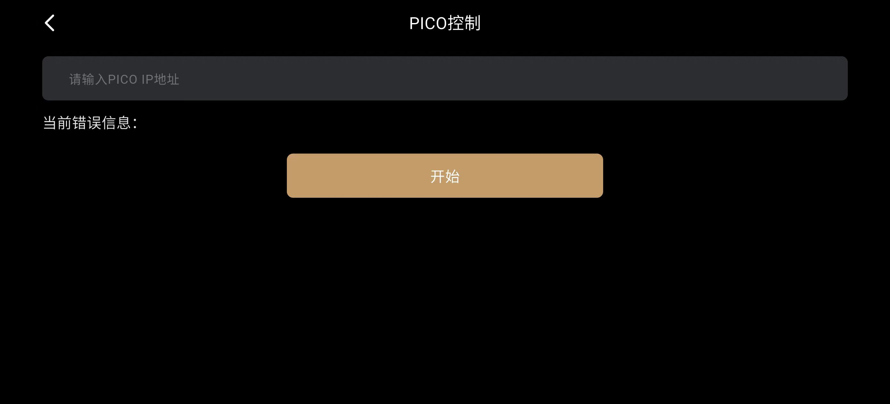

# Magicbot-Gen1 PICO4 Ultra Teleoperation

## Overview
This repository implements teleoperation of the humanoid robot Magicbot-Gen1 using PICO4 Ultra.

## Getting started

### Connect to Magicbot-Gen1
1. Connect to the robot via MagicLab APP and tap the mode selection button.

2. Choose remote control stunt mode.  

3. Press and hold the stand button, then place the robot on a flat surface. 

4. Click the gait button at the bottom and then the posture display button on the right to switch to posture display mode.  

### Connect to PICO4 Ultra
1. Wear the VR headset and attach motion sensors to your chest and the back of each wrist.

2. Connect both the PICO and the robot to the same Wi-Fi network.

3. Launch the TeleOp program in PICO.

4. Select Motion as the tracking mode.

5. Record the IP address of the PICO4 Ultra.  

6. Click the settings button in the upper right corner and select PICO control.

7. Enter the IP address of the PICO4 Ultra and click the start button.

8. Press the x and y buttons on the left controller in sequence to start teleoperation. When finished, press the end button to stop.